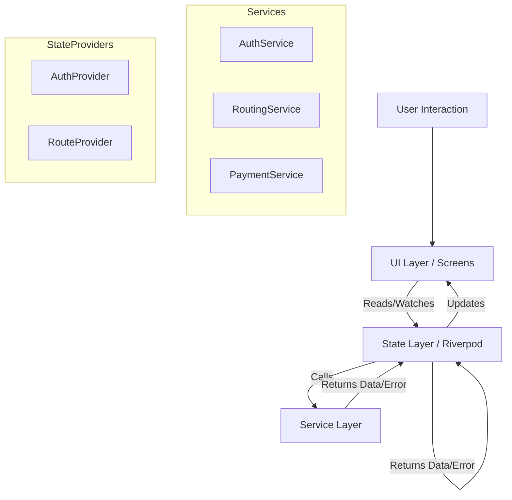

# Project Architecture

## Overview
Smart Transit is a Flutter-based mobile application designed for urban transport planning. It uses a modern, layered architecture to ensure separation of concerns, scalability, and testability.

## Architecture Patterns

### 1. Layered Architecture
The project is organized into distinct layers:
- **UI Layer (`lib/screens`, `lib/widgets`)**: Handles user interaction and presentation. Purely declarative UI components.
- **State Management Layer (`lib/state`)**: Uses **Riverpod** to manage application state and business logic. Acts as the bridge between UI and Data.
- **Service Layer (`lib/services`)**: encapsulating external data sources (mocked for this project).
- **Model Layer (`lib/models`)**: Immutable data classes defining the domain objects (`Station`, `Ticket`, `Route`, `Failure`).

### 2. State Management (Riverpod)
We use `flutter_riverpod` for dependency injection and state management.
- **Providers**: `authProvider`, `routeResultProvider`, `settingsProvider` etc. are defined globally and injected where needed.
- **ConsumerWidget/ConsumerStatefulWidget**: UI components subscribe to changes deeply in the widget tree without standard `setState` drilling.

### 3. Navigation (GoRouter)
Data-driven routing is implemented using `go_router`.
- Defined in `lib/router.dart` (or `main.dart`).
- Handles deep linking and logical navigation stacks (e.g. `context.go('/planner')` vs `context.push('/details')`).

### 4. Adaptive UI
The application implements adaptive navigation for different screen sizes:
- **Mobile (<600px)**: Uses `BottomNavigationBar`.
- **Tablet/Desktop (>600px)**: Uses `NavigationRail`.
- Logic resides in `HomeShell`.

## Folder Structure
```
lib/
├── l10n/            # Localization files (ARB)
├── models/          # Data classes (Ticket, Station, Failure)
├── screens/         # Full page views
│   ├── home_shell.dart  # Adaptive wrapper
│   ├── login_screen.dart
│   └── ...
├── services/        # Data providers (AuthService, RoutingService)
├── state/           # Riverpod providers
├── widgets/         # Reusable UI components (AppCard, StationLabel)
└── main.dart        # Entry point
```

## Data Flow Diagram



## Key Design Decisions
- **Failure Class**: A unified `Failure` class (`lib/models/failure.dart`) is used to handle exceptions across the app, ensuring consistent error messages to the user.
- **Mock Services**: All backend interactions (Auth, Routing) are simulated with delays to demonstrate realistic async behavior without a live server.
- **Localization**: Built-in support for English and Arabic using `flutter_localizations`.
